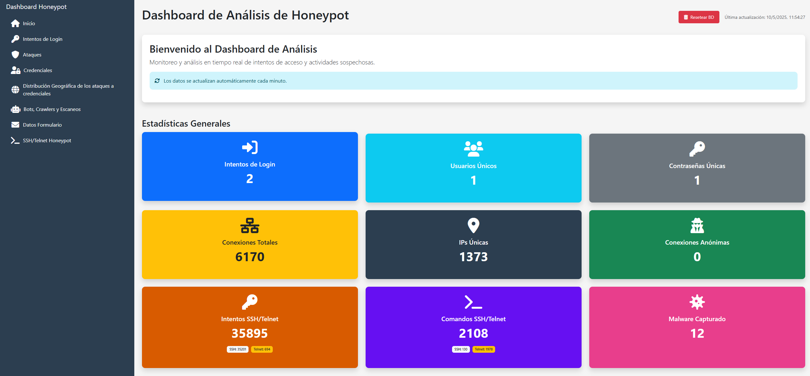

# Crawler-Honeypot

Un sistema de honeypot para capturar y analizar intentos de acceso y posibles ataques, compuesto por servicios dockerizados.
Cada pestaña del dashboard situada a la izquierda es una sección para visualizar con más detenimiento los datos que se van recabando.

## Descripción

El proyecto consiste en varios servicios principales desplegados en contenedores Docker:

1. **Página Web Expuesta (Public Web)**: Actúa como honeypot para capturar intentos de acceso y ataques.
2. **Honeypot SSH/Telnet**: Simula un servidor SSH y Telnet vulnerable para capturar credenciales y comandos.
3. **Dashboard de Análisis Local (Local Dashboard)**: Visualiza y analiza los datos capturados.
4. **Base de Datos MongoDB**: Almacena toda la información capturada.

## Características Principales

### Captura y Detección
- Registro de intentos de login mediante honeytokens (sin credenciales fijas)
- Detección de múltiples tipos de ataques (SQL Injection, XSS, Command Injection, Path Traversal)
- Captura de comandos específicos utilizados en ataques
- Registro detallado de solicitudes web (IPs, User Agents, etc.)
- Simulación de servidor SSH/Telnet con credenciales débiles configurables
- Captura de malware descargado por atacantes
- Registro de sesiones SSH/Telnet completas

### Análisis y Visualización
- Dashboard con actualización en tiempo real
- Estadísticas generales y gráficos temporales
- Análisis geográfico de conexiones
- Detección de IPs maliciosas, VPNs y conexiones anónimas
- Identificación de bots y crawlers
- Visualización de comandos ejecutados en sesiones SSH/Telnet
- Análisis básico de malware descargado
- Integración con VirusTotal para escaneo de archivos maliciosos

### Seguridad y Mantenimiento
- Acceso local seguro al dashboard mediante HTTPS
- Contención del honeypot SSH/Telnet en entorno aislado
- Múltiples capas de seguridad para prevenir compromiso del host

## Tecnologías Utilizadas

- **Backend**: Python, Flask
- **Frontend**: Bootstrap 5, JavaScript, Chart.js
- **Base de Datos**: MongoDB 6.0
- **Contenedores**: Docker, Docker Compose

## Requisitos Previos

El sistema requiere los siguientes componentes:

- **Docker** (versión 20.10 o superior) - **OBLIGATORIO**
- **Docker Compose** (versión 2.0 o superior) - **OBLIGATORIO**
- **Python distutils** - **OBLIGATORIO** (necesario para algunos componentes del sistema)
- **Conexión a Internet** (para las APIs externas)
- **Mínimo 2GB de RAM disponible**

### Instalación de Docker y Docker Compose

#### Ubuntu/Debian
```bash
# Instalar Docker
sudo apt update
sudo apt install docker.io

# Instalar Docker Compose
sudo apt install docker-compose

# Añadir usuario al grupo docker (evita usar sudo en cada comando)
sudo usermod -aG docker $USER
# Importante: Cierra sesión y vuelve a iniciarla para que los cambios surtan efecto
```
## Instalación y Ejecución

1. **Iniciar los servicios**:

   ```bash
   chmod +x start-honeypot.sh
   ./start-honeypot.sh
   ```
   
   El script automáticamente:
   - Verifica dependencias
   - Configura el entorno
   - Comprueba la presencia de archivos de configuración necesarios
   - Inicia todos los servicios incluyendo el honeypot SSH/Telnet

2. **Acceder a los servicios**:
   - Honeypot Web: http://localhost:80
   - Honeypot SSH: localhost:2222
   - Honeypot Telnet: localhost:23  
   - Dashboard: https://localhost:8443 (HTTPS) o http://localhost:8080 (HTTP)

## Configuración

### Honeytokens

Los honeytokens se configuran en el archivo `/public-web/src/honeytokens.json`:

```json
{
  "sistemas": "Sistemas2023!",
  "administrator": "Admin@2023",
  "admin": "admin123",
  "test": "test123",
  "user": "password123",
  "guest": "guest2023",
  "root": "toor"
}
```

Estos honeytokens actúan como credenciales trampa que permiten detectar intentos de acceso maliciosos.

### Variables de Entorno

Las configuraciones principales se encuentran en el archivo `.env` en la raíz del proyecto y es necesario añadirlas:

- **Credenciales del Dashboard**: `DASHBOARD_USER`, `DASHBOARD_PASSWORD`
- **Conexión MongoDB**: `MONGODB_URI`, credenciales y configuración
- **Ajustes de Red**: `PUBLIC_NETWORK_SUBNET`, `PUBLIC_WEB_IP`

### Generación de Certificados SSL

Para que el dashboard local funcione con HTTPS, es necesario generar certificados SSL válidos:

1. **Crear el directorio `certs`** (si no existe):
   ```bash
   mkdir -p certs
   ```

2. **Generar certificado autofirmado**:
   ```bash
   # Generar clave privada
   openssl genrsa -out certs/server.key 2048

   # Generar certificado autofirmado (válido por 365 días)
   openssl req -new -x509 -key certs/server.key -out certs/server.crt -days 365 -subj "/CN=localhost"
   ```

3. **Ajustar permisos**:
   ```bash
   chmod 400 certs/server.key
   chmod 444 certs/server.crt
   ```

Si deseas un certificado más completo con información específica, puedes usar:
   ```bash
   openssl req -new -x509 -nodes -days 365 -key certs/server.key -out certs/server.crt
   ```
Y completar la información solicitada durante el proceso interactivo.

**Nota**: Al acceder al dashboard por HTTPS, tu navegador mostrará una advertencia de certificado no confiable porque es autofirmado. Esto es normal y puedes proceder de forma segura.

## Servicios

### Public Web (Honeypot)
- Puerto: 80
- Función: Expone interfaces de login y páginas para atraer y registrar actividad sospechosa
- Logs: `./public-web/logs`

### Local Dashboard
- Puertos: 8080 (HTTP), 8443 (HTTPS)
- Acceso: Solo desde localhost (127.0.0.1)
- Función: Analiza y visualiza los datos capturados
- Logs: `./local-dashboard/logs`

### MongoDB
- Puerto: 27017 (solo accesible desde localhost)
- Función: Almacena todos los datos capturados
- Volumen: `mongodb_data` (persistente)

## Honeypot SSH y Telnet (Cowrie)

El sistema incluye un honeypot SSH y Telnet basado en Cowrie, que simula un sistema Linux vulnerable para capturar y analizar los ataques realizados mediante estos protocolos.

### Características del Honeypot SSH/Telnet

- **Simulación completa**: Emula un sistema Debian Linux con bash
- **Usuarios y contraseñas débiles**: Configurados para aceptar combinaciones comunes
- **Captura de credenciales**: Registra todos los intentos de login (exitosos y fallidos)
- **Registro de comandos**: Captura cada comando ejecutado por los atacantes
- **Descarga de malware**: Almacena y analiza archivos maliciosos descargados
- **Integración con MongoDB**: Almacena todos los eventos en la misma base de datos
- **Soporte para Telnet**: Además de SSH, también expone un servicio Telnet vulnerable
- **Seguridad reforzada**: Contenedor aislado con múltiples capas de protección

### Puertos utilizados

- **SSH**: Puerto 2222
- **Telnet**: Puerto 23

### Seguridad

El honeypot SSH/Telnet incluye varias capas de seguridad:

- Contenedor sin privilegios con permisos limitados
- Perfil seccomp para filtrado de syscalls
- Sistema de archivos de solo lectura
- Recursos de sistema limitados
- Red aislada con acceso controlado
- Reinicio automático periódico

### Visualización en el Dashboard

El dashboard muestra en tiempo real:

- Estadísticas de intentos de acceso
- Contraseñas y usuarios más utilizados
- Comandos ejecutados por los atacantes
- Archivos maliciosos descargados
- Análisis de malware mediante integración con VirusTotal

## Mantenimiento

### Comandos Útiles

- **Ver logs**: `docker-compose logs [servicio]`
- **Reiniciar servicios**: `docker-compose restart [servicio]`
- **Detener todos los servicios**: `docker-compose down`
- **Ver estado de contenedores**: `docker-compose ps`

## Seguridad

Este proyecto está diseñado como honeypot para investigación. Para mayor seguridad:

- Las credenciales basadas en honeytokens no permiten acceso real al sistema
- El dashboard solo es accesible desde localhost (127.0.0.1)
- Los datos sensibles están aislados en redes Docker internas
- Los servicios SSH y Telnet están configurados con múltiples capas de seguridad:
  - Contenedor con acceso limitado y sin privilegios
  - Filtrado de syscalls mediante seccomp
  - Sistema de archivos inmutable
  - Límites estrictos de recursos
  - El malware descargado se mantiene aislado en volúmenes de solo lectura

### Advertencias de Seguridad
⚠️ **IMPORTANTE**:
- El servicio SSH utiliza el puerto 2222, lo que puede entrar en conflicto con configuraciones existentes
- Nunca ejecutes el honeypot en un servidor que contenga datos sensibles
- Considera ejecutar el sistema completo en una máquina virtual aislada
- Mantén el sistema actualizado aplicando actualizaciones de seguridad
- Ten cuidado al analizar el malware capturado, incluso en el entorno aislado

## Ejemplos de Uso

### Análisis de ataques de fuerza bruta
El sistema registra automáticamente los intentos de login fallidos, permitiendo identificar patrones y credenciales comúnmente utilizadas en ataques.

### Captura de malware
Cuando un atacante logra acceder al servicio SSH y descarga malware, el sistema:
1. Captura el archivo malicioso
2. Extrae información (hashes, tipo, tamaño)
3. Almacena el contenido de forma segura
4. Genera visualización segura en el dashboard

### Monitoreo de actividad de atacantes
El sistema registra todos los comandos ejecutados, permitiendo entender las técnicas y herramientas utilizadas por los atacantes.

## Mantenimiento

Para reiniciar los servicios:
```bash
docker-compose restart
```

Para detener el honeypot:
```bash
docker-compose down
```

Para ver los logs:
```bash
docker-compose logs -f
```


## Descargo de responsabilidad

Este software se proporciona con fines educativos y de investigación. No me hago responsable del mal uso de esta herramienta. 